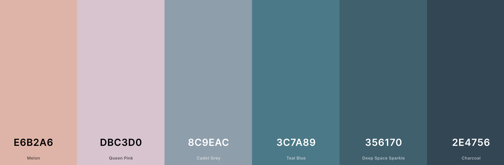

# What's the Tea?

What's the Tea? is an idea I came up with just exclusivly for this project. The organization is located in Stockholm. The main goal is to spread positivity, care and love and everyone is welcome no matter the gender. The website presents a Home page with an 'About' and 'Contact & Info' section. The Gallery page is built from a bunch of inspirational lgbtq+ photos. And last but not least the Sign Up page contains the events sign up form.

I was inspired by the RuPaul's Drag Race show created by RuPaul Charles who is the ICON of the LGBTQ+ comunity all over the world. The show has grown a lot and as a member of the LGBTQ+ comunity I wanted to celebrate my pride by creating my first project based on this idea. 

---

[View live site on Github Pages](https://balkaneros91.github.io/whats-the-tea/)

---

## CONTENTS

* [User Experience](#user-experience-ux)
  * [User Stories](#user-stories)

* [Design](#design)
  * [Colour Scheme](#colour-scheme)
  * [Typography](#typography)
  * [Imagery](#imagery)
  * [Wireframes](#wireframes)

* [Features](#features)
  * [General Features on Each Page](#general-features-on-each-page)
  * [Future Implementations](#future-implementations)
  * [Accessibility](#accessibility)

* [Technologies Used](#technologies-used)
  * [Languages Used](#languages-used)
  * [Frameworks, Libraries & Programs Used](#frameworks-libraries--programs-used)

* [Deployment & Local Development](#deployment--local-development)
  * [Deployment](#deployment)
  * [Local Development](#local-development)
    * [How to Fork](#how-to-fork)
    * [How to Clone](#how-to-clone)

* [Testing](#testing)

* [Credits](#credits)
  * [Code Used](#code-used)
  * [Content](#content)
  * [Media](#media)
  * [Acknowledgments](#acknowledgments)

---
## User Experience (UX)

Visitors looking for a safe place to share their stories and a good laugh should find this website interesting and charming. We are a charitable organization with a goal of sharing information and helping people to get the answers they are looking for or in case  they need even further help pointing them towards the right direction.  

The front page provides the visitor with a short introduction and the events contact and info. Besides that they can visit webites gallery full with lgbtq+ related sharing and caring photos. 

In case you wanna have some fun and share your story proceed to our sign up page. 

The website is viewable from different screen sizes, so every user can browse the site.

---
### User Stories

---

## Design

### Colour Scheme

I wanted my page to be colorful but in a appropriate way so I fetched as friendly as possible for eyes color palette based off of the hero image, which I thought would be a well suited color scheme for the full website. 

[Coolors.co](https://coolors.co/) was the website I've used to fetch the colour palette presented.

---

