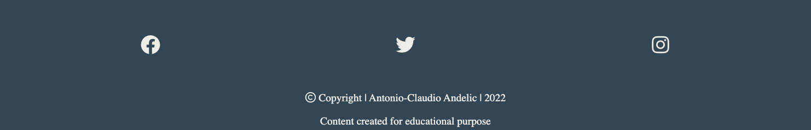

# What's the Tea?

What's the Tea? is an idea I came up with just exclusivly for this project. The organization is located in Stockholm. The main goal is to spread positivity, care and love and everyone is welcome no matter the gender. The website presents a Home page with an 'About' and 'Contact & Info' section. The Gallery page is built from a bunch of inspirational lgbtq+ photos. And last but not least the Sign Up page contains the events sign up form.

I was inspired by the RuPaul's Drag Race show created by RuPaul Charles who is the ICON of the LGBTQ+ comunity all over the world. The show has grown a lot and as a member of the LGBTQ+ comunity I wanted to celebrate my pride by creating my first project based on this idea. 

---

[View live site on Github Pages](https://balkaneros91.github.io/whats-the-tea/)

---

## CONTENTS

* [User Experience](#user-experience-ux)
  * [User Stories](#user-stories)

* [Design](#design)
  * [Colour Scheme](#colour-scheme)
  * [Typography](#typography)
  * [Imagery](#imagery)
  * [Wireframes](#wireframes)

* [Features](#features)
  * [General Features on Each Page](#general-features-on-each-page)
  * [Future Implementations](#future-implementations)
  * [Accessibility](#accessibility)

* [Technologies Used](#technologies-used)
  * [Languages Used](#languages-used)
  * [Frameworks, Libraries & Programs Used](#frameworks-libraries--programs-used)

* [Deployment & Local Development](#deployment--local-development)
  * [Deployment](#deployment)
  * [Local Development](#local-development)
    * [How to Fork](#how-to-fork)
    * [How to Clone](#how-to-clone)

* [Testing](#testing)

* [Credits](#credits)
  * [Code Used](#code-used)
  * [Content](#content)
  * [Media](#media)
  * [Acknowledgments](#acknowledgments)

---
## User Experience (UX)

Visitors looking for a safe place to share their stories and a good laugh should find this website interesting and charming. We are a charitable organization with a goal of sharing information and helping people to get the answers they are looking for or in case  they need even further help pointing them towards the right direction.  

The front page provides the visitor with a short introduction and the events contact and info. Besides that they can visit webites gallery full with lgbtq+ related sharing and caring photos. 

In case you wanna have some fun and share your story proceed to our sign up page. 

The website is viewable from different screen sizes, so every user can browse the site.

---
### User Stories

---

## Design

### Colour Scheme

I wanted my page to be colorful but in a appropriate way so I fetched as friendly as possible for eyes color palette based off of the hero image, which I thought would be a well suited color scheme for the full website. 

[Coolors.co](https://coolors.co/) was the website I've used to fetch the colour palette presented.

---
### Typography

It was hard to find a perfectly matching fonts, and now I sound totally like a beginner, which looked good and readable. Finally I picked Great Vibes, Acme and for the rest I thought it looks the best with sans-serif.

I used Great Vibes to decorate the website logo, then I used Acme for the quotation and the main sections title and for the rest I left it on sans-serif since that suited the paragraphs best.

and sans-serif font.

---
### Imagery

Since the organization is all about the lgbtq+ and rainbow I thought that pictures related to that would perfectly fullfill the pages value and message.

### Wireframes

---
text missing.......................

---

## Features

My website is built of 3 pages, index.html as a home page, gallery.html as the gallery page, and signup.html as the sign up page. 

### Final look of the Home page

### Final look of the Gallery page
Because my screen is a little bit bigger I've had to crop the images to get full view. 

### Final look of the Contact page

## Footer

### General features on each page

The navigation menu and footer is continiously the same throughout all three pages of my website.

### Future Implementations

This page has a potential to grow even further more by adding more content to it plus images for to spice it up and space it into bigger website.

In the future this event could from being a place to feel safe and funny implement even bigger shows as talkshows and dragshows. But one step at the time.

### Accessibility

I have  have tried my best to be mindful of accessibility, and the steps I've taken for this are the following:

- Semantic HTML
- All the links has their aria-labels
- The color choice and the backgroud images doesn't disturb the content
- All the images under the gallery site are informativly described 

## Technologies Used

### Languages Used

HTML & CSS.

### Frameworks, Libraries & Programs Used

I have followed CI recommendation and used Github plus Gitpod.

For wireframes I have used the programme Balsamic. 

## Deployment & Local Development

### Deployment

[View live site on Github Pages](https://balkaneros91.github.io/whats-the-tea/)

### Local Development

If you wish to clone my project, please see the following steps below:

1. Navigate to Github: https://balkaneros91.github.io/whats-the-tea/
2. Select the 'Clone' button 
3. Copy the url or download as ZIP file
4. Use git clone + the url in your terminal, or unpack the ZIP containing the project

## Testing

All the links in the navigation bar and in the footer has been tested and works. The logo link always brings us back to the main page, while the About and Contact links are only index.html local links so avoid scrolling up and down on the page. The rest as Gallery and Sign Up links opens a new tab in the browser for easier navigation between pages. And the deployed website has been tested in Chrome, Safari, Internet Explorer (Opera) and Firefox. Media queries looks good and been tested throughout different screen sizes.

I have used Responsinator.com for testing:
- [responsinator](http://www.responsinator.com/)

### Lighthouse

### W3C HTML Validator

### W3C CSS Validator

### Known bugs

No known bugs detected

---
---
---
---

## Credits

Code Institue projects: Coders Coffehouse and Love Running has been the inspiration for my websites design.
The help I've used with syntax and formatting, please see links and description below.

### Code Used

- [w3schools](https://www.w3schools.com/)
- [How to position text above an image](https://www.w3schools.com/HOWTO/howto_css_image_text.asp)
- [CSS Media Queries](https://www.w3schools.com/css/css3_mediaqueries.asp)
- [Grid-View](https://www.w3schools.com/css/css_rwd_grid.asp)
- [emmet.io](https://docs.emmet.io/cheat-sheet/)

### Content

The code is mostly created by me and I was inspired by some of the contect in the above mentioned section, Code Used plus by the code watched on LSM in CI projects.

###  Media

All images are downloaded from
[Unsplash](https://unsplash.com/) and
[Pexels](https://www.pexels.com/sv-se/) plus
and I used private pictures.
  
###  Acknowledgments

And last but not least a big thanks and loads of kudos to those who has in some way helped me so I could complete my first project:  

- Nedicto Entenza Gutierrez, my husband.
- Antonio Rodriguez, my mentor at Code Institute.
- Sawyer, our cooridinator and mental column.
- Gemma our lovely tutor at Code Institute.
- Kera Cudmore, for the README webinar and this README template.

